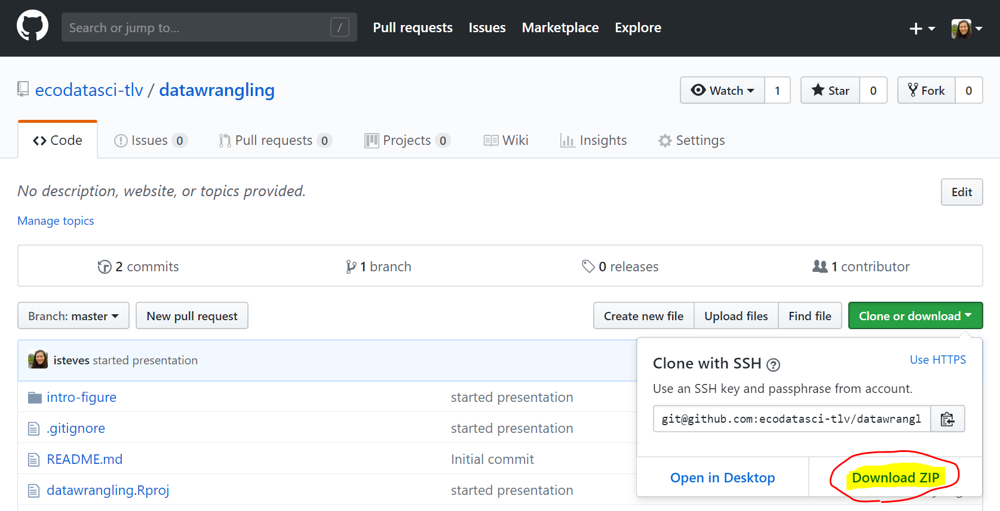
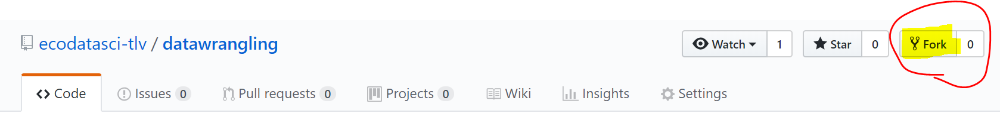
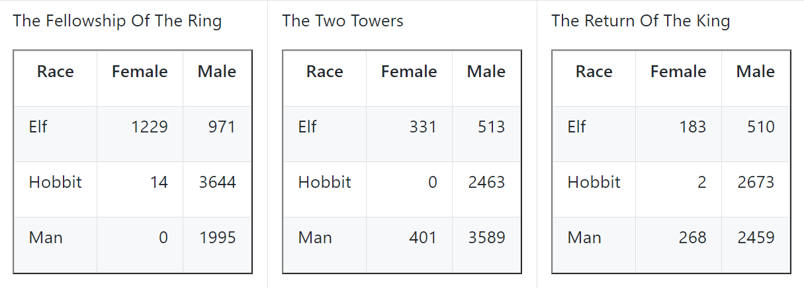
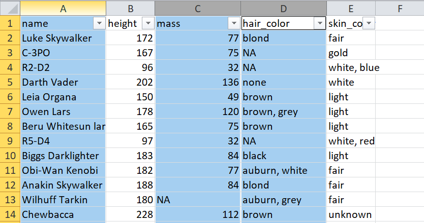
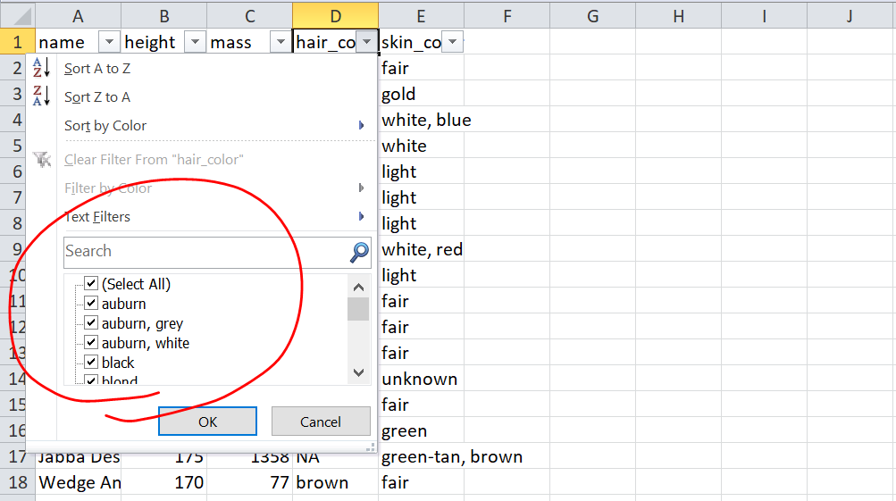
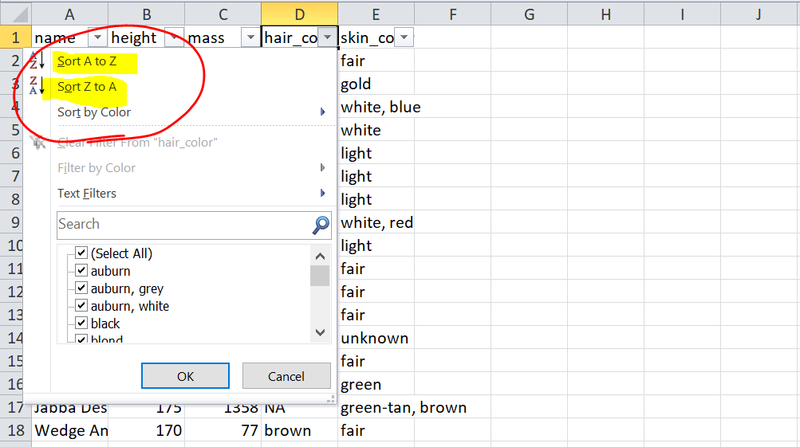
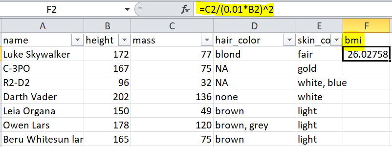
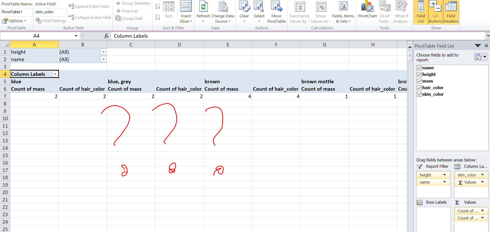

Data wrangling with the Tidyverse
========================================================
author: Hezi Buba & Irene Steves
date: 31 October 2018
autosize: true

Presentation materials: https://github.com/ecodatasci-tlv/datawrangling  
Short link: https://bit.ly/2AuTVoD

Projects in R
========================================================


Comfortable but hard to reproduce

***

 

Portable, organized, minimalistic

Why use projects?
========================================================

Projects help to maintain good workflow habits:

- **Fresh R processes** - each project comes with its own environment
- **Portability** - projects have clearly defined base directories; use relative paths to keep projects portable 

Extra reading: [workflow versus script](https://www.tidyverse.org/articles/2017/12/workflow-vs-script/), [basic care and feeding of data in R](http://stat545.com/block006_care-feeding-data.html)

GitHub
========================================================

GitHub is a code storage/sharing platform. Use it to:

- browse source code ([CRAN](https://github.com/cran),  [tidyverse](https://github.com/tidyverse/), [rOpenSci](https://github.com/ropensci), [r-lib](https://github.com/r-lib))
- use packages not on CRAN (`devtools::install_github("account_name/repo_name")`)
- share/store analyses and functions
- browse past versions of code
- host web pages

Cloning GitHub repositories 
========================================================

If you _don't_ have git installed: get GitHub files off the web and onto your local computer by clicking `Download ZIP`.



Cloning GitHub repositories 
========================================================

If you _have_ git installed and ready to go on RStudio (excellent instructions [here](http://happygitwithr.com/)), you can do the following:

(1) FORK the repository (make a copy of it to your github.com account)



(2) In RStudio: `File --> New Project --> Version Control --> Git`. The repository URL should be in the form: `https://github.com/YOUR_ACCOUNT/REPO_NAME`.


Tibbles
========================================================

>Tibbles are data.frames that are lazy and surly: **they do less** (i.e. they don't change variable names or types, and don't do partial matching) and **complain more** (e.g. when a variable does not exist). This forces you to confront problems earlier, typically leading to cleaner, more expressive code.

https://tibble.tidyverse.org/

Tibble print nicely!
========================================================


```r
library(tidyverse)
as_tibble(iris)
```

Tidy data
========================================================

>If I had one thing to tell biologists learning bioinformatics, it would be “write code for humans, write data for computers”.
>
>— Vince Buffalo (@vsbuffalo) July 20, 2013

===



https://github.com/jennybc/lotr-tidy/blob/master/01-intro.md

===


```
# A tibble: 6 x 4
  Film                       Gender Race   Words
  <chr>                      <chr>  <chr>  <chr>
1 The Fellowship Of The Ring Female Elf    1229 
2 The Fellowship Of The Ring Male   Elf    971  
3 The Two Towers             Female Elf    331  
4 The Two Towers             Male   Elf    513  
5 The Return Of The King     Male   Hobbit 2673 
6 The Return Of The King     Female Man    268  
```

Code should be pleasant to read
===


insert bad script

===


Tidyverse
===

- shared syntax & conventions
- tibble in, tibble out

select()
===



filter()
===


arrange()
===


mutate()
===


group_by(), summarize()
===


Pipe ("then")
===


***

Data in, data out


```r
data %>% 
    do_something() %>% 
    do_another_thing() 
```

Star wars
===

```r
library(tidyverse)
data(starwars)
```

===


```r
starwars %>% 
    select(name, height, mass, species)
```

```
# A tibble: 87 x 4
   name               height  mass species
   <chr>               <int> <dbl> <chr>  
 1 Luke Skywalker        172    77 Human  
 2 C-3PO                 167    75 Droid  
 3 R2-D2                  96    32 Droid  
 4 Darth Vader           202   136 Human  
 5 Leia Organa           150    49 Human  
 6 Owen Lars             178   120 Human  
 7 Beru Whitesun lars    165    75 Human  
 8 R5-D4                  97    32 Droid  
 9 Biggs Darklighter     183    84 Human  
10 Obi-Wan Kenobi        182    77 Human  
# ... with 77 more rows
```

===


```r
starwars %>% 
    select(name, height, mass, species) %>% 
    mutate(bmi = mass/(0.01*height)^2)
```

```
# A tibble: 87 x 5
   name               height  mass species   bmi
   <chr>               <int> <dbl> <chr>   <dbl>
 1 Luke Skywalker        172    77 Human    26.0
 2 C-3PO                 167    75 Droid    26.9
 3 R2-D2                  96    32 Droid    34.7
 4 Darth Vader           202   136 Human    33.3
 5 Leia Organa           150    49 Human    21.8
 6 Owen Lars             178   120 Human    37.9
 7 Beru Whitesun lars    165    75 Human    27.5
 8 R5-D4                  97    32 Droid    34.0
 9 Biggs Darklighter     183    84 Human    25.1
10 Obi-Wan Kenobi        182    77 Human    23.2
# ... with 77 more rows
```

===


```r
starwars %>% 
    select(name, height, mass, species) %>% 
    mutate(bmi = mass/(0.01*height)^2) %>% 
    arrange(desc(bmi))
```

```
# A tibble: 87 x 5
   name                  height  mass species          bmi
   <chr>                  <int> <dbl> <chr>          <dbl>
 1 Jabba Desilijic Tiure    175  1358 Hutt           443. 
 2 Dud Bolt                  94    45 Vulptereen      50.9
 3 Yoda                      66    17 Yoda's species  39.0
 4 Owen Lars                178   120 Human           37.9
 5 IG-88                    200   140 Droid           35  
 6 R2-D2                     96    32 Droid           34.7
 7 Grievous                 216   159 Kaleesh         34.1
 8 R5-D4                     97    32 Droid           34.0
 9 Jek Tono Porkins         180   110 Human           34.0
10 Darth Vader              202   136 Human           33.3
# ... with 77 more rows
```

===


```r
starwars %>% 
    select(name, height, mass, species) %>% 
    mutate(bmi = mass/(0.01*height)^2) %>% 
    filter(species == "Droid")
```

```
# A tibble: 5 x 5
  name  height  mass species   bmi
  <chr>  <int> <dbl> <chr>   <dbl>
1 C-3PO    167    75 Droid    26.9
2 R2-D2     96    32 Droid    34.7
3 R5-D4     97    32 Droid    34.0
4 IG-88    200   140 Droid    35  
5 BB8       NA    NA Droid    NA  
```

===


```r
starwars %>% 
    select(name, height, mass, species) %>% 
    mutate(bmi = mass/(0.01*height)^2) %>% 
    filter(species == "Droid", height < 100)
```

```
# A tibble: 2 x 5
  name  height  mass species   bmi
  <chr>  <int> <dbl> <chr>   <dbl>
1 R2-D2     96    32 Droid    34.7
2 R5-D4     97    32 Droid    34.0
```

===


```r
starwars %>% 
    select(name, height, mass, species) %>% 
    group_by(species) %>% 
    summarize(count = n(),
              avg_mass = mean(mass, na.rm = TRUE),
              max_height = max(height, na.rm = TRUE)) %>% 
    arrange(desc(count))
```

```
# A tibble: 38 x 4
   species  count avg_mass max_height
   <chr>    <int>    <dbl>      <dbl>
 1 Human       35     82.8        202
 2 Droid        5     69.8        200
 3 <NA>         5     48          183
 4 Gungan       3     74          224
 5 Kaminoan     2     88          229
 6 Mirialan     2     53.1        170
 7 Twi'lek      2     55          180
 8 Wookiee      2    124          234
 9 Zabrak       2     80          175
10 Aleena       1     15           79
# ... with 28 more rows
```

Your turn
===

- What is the most common eye color?
- Who is the youngest human?
- Which homeworld has the most characters?

What else can you do?
===

- conditional functions: `*_at`, `*_if`, `*_all`
- `rename` columns
- `lead` & `lag` for time series
- `join` & `bind` data frames
- `count` & `tally` shortcuts for group_by and summarize

gather() & spread()
===


https://datacarpentry.org/R-ecology-lesson/03-dplyr.html

Community matrix!
===


```r
starwars %>% 
    select(name, films) %>% 
    unnest(films) %>% 
    mutate(present = 1) %>% 
    spread(name, present, fill = 0)
```

```
# A tibble: 7 x 88
  films Ackbar `Adi Gallia` `Anakin Skywalk~ `Arvel Crynyd` `Ayla Secura`
  <chr>  <dbl>        <dbl>            <dbl>          <dbl>         <dbl>
1 A Ne~      0            0                0              0             0
2 Atta~      0            0                1              0             1
3 Retu~      1            0                0              1             0
4 Reve~      0            1                1              0             1
5 The ~      0            0                0              0             0
6 The ~      1            0                0              0             0
7 The ~      0            1                1              0             1
# ... with 82 more variables: `Bail Prestor Organa` <dbl>, `Barriss
#   Offee` <dbl>, BB8 <dbl>, `Ben Quadinaros` <dbl>, `Beru Whitesun
#   lars` <dbl>, `Bib Fortuna` <dbl>, `Biggs Darklighter` <dbl>, `Boba
#   Fett` <dbl>, Bossk <dbl>, `C-3PO` <dbl>, `Captain Phasma` <dbl>,
#   Chewbacca <dbl>, `Cliegg Lars` <dbl>, Cordé <dbl>, `Darth Maul` <dbl>,
#   `Darth Vader` <dbl>, `Dexter Jettster` <dbl>, Dooku <dbl>,
#   Dormé <dbl>, `Dud Bolt` <dbl>, `Eeth Koth` <dbl>, `Finis
#   Valorum` <dbl>, Finn <dbl>, Gasgano <dbl>, Greedo <dbl>, `Gregar
#   Typho` <dbl>, Grievous <dbl>, `Han Solo` <dbl>, `IG-88` <dbl>, `Jabba
#   Desilijic Tiure` <dbl>, `Jango Fett` <dbl>, `Jar Jar Binks` <dbl>,
#   `Jek Tono Porkins` <dbl>, `Jocasta Nu` <dbl>, `Ki-Adi-Mundi` <dbl>,
#   `Kit Fisto` <dbl>, `Lama Su` <dbl>, `Lando Calrissian` <dbl>, `Leia
#   Organa` <dbl>, Lobot <dbl>, `Luke Skywalker` <dbl>, `Luminara
#   Unduli` <dbl>, `Mace Windu` <dbl>, `Mas Amedda` <dbl>, `Mon
#   Mothma` <dbl>, `Nien Nunb` <dbl>, `Nute Gunray` <dbl>, `Obi-Wan
#   Kenobi` <dbl>, `Owen Lars` <dbl>, `Padmé Amidala` <dbl>,
#   Palpatine <dbl>, `Plo Koon` <dbl>, `Poe Dameron` <dbl>, `Poggle the
#   Lesser` <dbl>, `Quarsh Panaka` <dbl>, `Qui-Gon Jinn` <dbl>,
#   `R2-D2` <dbl>, `R4-P17` <dbl>, `R5-D4` <dbl>, `Ratts Tyerell` <dbl>,
#   `Raymus Antilles` <dbl>, Rey <dbl>, `Ric Olié` <dbl>, `Roos
#   Tarpals` <dbl>, `Rugor Nass` <dbl>, `Saesee Tiin` <dbl>, `San
#   Hill` <dbl>, Sebulba <dbl>, `Shaak Ti` <dbl>, `Shmi Skywalker` <dbl>,
#   `Sly Moore` <dbl>, Tarfful <dbl>, `Taun We` <dbl>, `Tion Medon` <dbl>,
#   `Wat Tambor` <dbl>, Watto <dbl>, `Wedge Antilles` <dbl>, `Wicket
#   Systri Warrick` <dbl>, `Wilhuff Tarkin` <dbl>, `Yarael Poof` <dbl>,
#   Yoda <dbl>, `Zam Wesell` <dbl>
```

Take home messages
===

- your most important collaborator = future you!
- keep code readable and re-runnable


Your turn!
===

https://github.com/rfordatascience/tidytuesday/tree/master/data/2018-10-23  
Short link: https://bit.ly/2CQMvho

Resources
===

https://github.com/gadenbuie/tidyexplain
